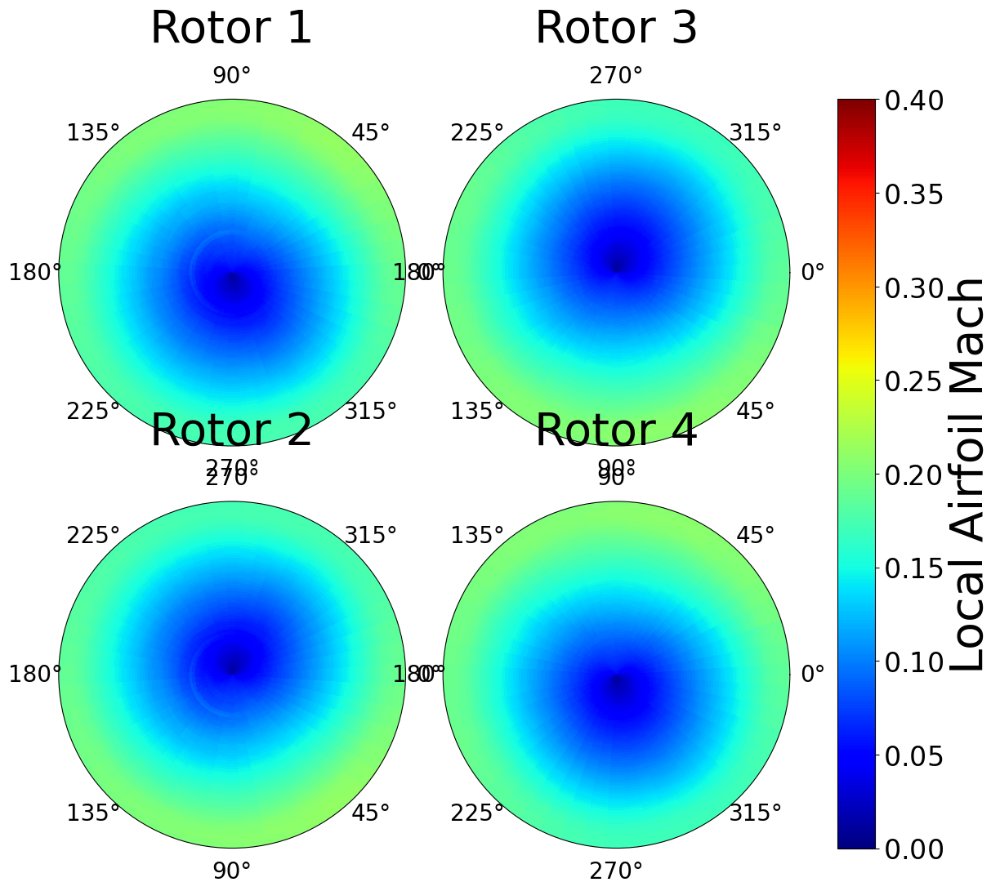

# charm_to_quietfly

I modified the res reading function in the results.py file to read fixed line widths. This fixed the issue when the .res file has double digit negative value that gets rid of the space.

 

